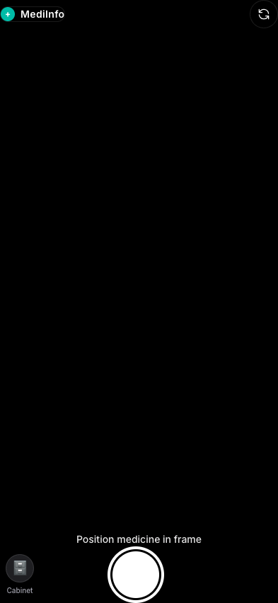

# 💊 MediInfo - Medicine Information Lookup

A mobile-responsive Progressive Web App that uses AI vision to identify medicines and display their information instantly.



## ✨ Features

- **📷 Camera Capture** - Point your phone camera at any medicine package
- **🤖 AI-Powered** - Uses Kimi (Moonshot AI) for instant medicine identification

## 🚀 Quick Start

### Prerequisites

- Node.js 18+
- A Kimi API key from [Moonshot AI](https://platform.moonshot.cn/)

### Installation

```bash
# Clone the repository
git clone <your-repo-url>
cd medicine_finder

# Install dependencies
npm install

# Create environment file
cp .env.example .env

# Add your Kimi API key to .env
# MOONSHOT_API_KEY=your_api_key_here
```

### Development

```bash
# Start the API server (in one terminal)
npm run server

# Start the Vite dev server (in another terminal)
npm run dev

# Or run both together (requires concurrently package)
npm install concurrently
npm run dev:all
```

Open http://localhost:5173 in your browser.

### Production Build

```bash
npm run build
npm run preview
```

## 🌐 Deployment

### Deploy to Vercel

1. Push your code to GitHub
2. Import the project in [Vercel](https://vercel.com)
3. Add the `MOONSHOT_API_KEY` environment variable in Vercel dashboard
4. Deploy!

```bash
# Or use Vercel CLI
npm install -g vercel
vercel login
vercel --prod
```

## 📁 Project Structure

```
medicine_finder/
├── api/
│   └── analyze-medicine.js    # Vercel Edge Function for Kimi API
├── public/
│   ├── pwa-192x192.png        # PWA icon (small)
│   └── pwa-512x512.png        # PWA icon (large)
├── src/
│   ├── components/
│   │   ├── CameraCapture.jsx  # Camera interface component
│   │   ├── LoadingOverlay.jsx # Scanning animation overlay
│   │   └── ResultCard.jsx     # Medicine info display card
│   ├── App.jsx                # Main app component
│   ├── main.jsx               # React entry point
│   └── index.css              # Global styles with Tailwind
├── server.js                  # Local dev API server
├── vite.config.js             # Vite + PWA configuration
├── vercel.json                # Vercel deployment config
└── .env.example               # Environment variables template
```

## 🛠️ Tech Stack

- **Frontend**: React 19 + Vite 7
- **Styling**: Tailwind CSS v4
- **PWA**: vite-plugin-pwa
- **AI**: Kimi (Moonshot AI)
- **Hosting**: Vercel (free tier)

## 💰 Cost

**$0/month** on free tiers:
- Vercel free tier for hosting
- Kimi free tier (or very low cost)

## 📱 Mobile Testing

The app requires HTTPS for camera access on mobile. Options:

1. **Local Network Testing**: Use `ngrok` to create HTTPS tunnel
2. **Deploy to Vercel**: Get automatic HTTPS
3. **Localhost Exception**: Desktop browsers allow camera on localhost

```bash
# Using ngrok for mobile testing
npx ngrok http 5173
```

## 🎯 How It Works

1. User opens app → Camera preview loads
2. User points at medicine package
3. User taps "Identify Medicine" button
4. Blue wave scanning animation plays
5. Image sent to Kimi Vision API
6. Response displayed as overlay card

## ⚠️ Disclaimer

This app provides AI-generated information for educational purposes only. Always consult a doctor or pharmacist for medical advice.

## 📄 License

MIT
